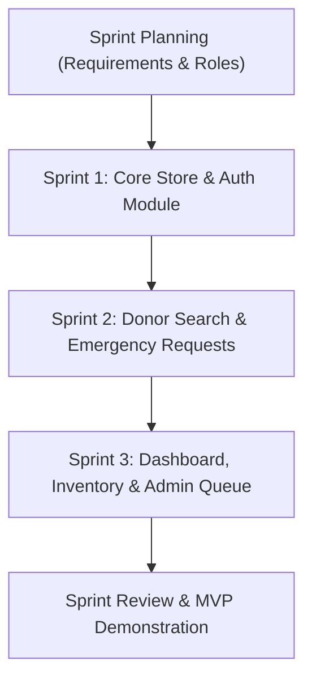
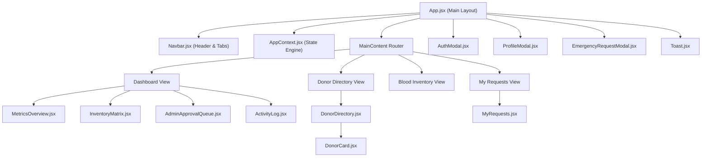

# Project Design Report: LifeFlow — Blood Donation Management System

**Course Code:** CSE 3206  
**Course Name:** Software Engineering Sessional  
**Institution:** Rajshahi University of Engineering & Technology (RUET), Rajshahi-6204, Bangladesh  
**Department:** Department of Computer Science & Engineering  
**Lab Assignment:** Lab 2 — Software Process Models, Requirement Analysis & MVP Development  
**Project #:** Project #7 — Blood Donation Management System  
**Process Model:** Agile Scrum  
**Marks:** 10  
**Motto:** Heaven's light is our guide  

---

## 1. Cover Page

* **Project Title:** LifeFlow — Emergency Blood Donation Matching & Central Reserve Management System
* **Submitted To:** Department of Computer Science & Engineering, RUET
* **Date of Submission:** August 15, 2026

---

## 2. Team Information (Group #07 — Section A)

| Team Member | Student Name | Roll Number | Role | Key Contributions |
| :--- | :--- | :--- | :--- | :--- |
| **Member 1 (Lead)** | **Apon Datta** | `2203019` | **Scrum Manager / Core Dev** | Repository setup, React Context state engine (`AppContext.jsx`), Authentication (`AuthModal.jsx`), Profile management (`ProfileModal.jsx`), Role Security. |
| **Member 2** | **Emon Islam** | `2203020` | **Frontend Feature Dev 1** | Donor Search Directory (`DonorDirectory.jsx`, `DonorCard.jsx`), Blood Group & Location Filtering, Emergency Request Modal (`EmergencyRequestModal.jsx`), Request Tracker (`MyRequests.jsx`). |
| **Member 3** | **Sanjida Tabassum** | `2203021` | **Frontend Feature Dev 2** | Analytics Dashboard (`MetricsOverview.jsx`), 8-Blood-Group Reserve Matrix (`InventoryMatrix.jsx`), Admin Approval Queue (`AdminApprovalQueue.jsx`), Activity Audit Feed (`ActivityLog.jsx`). |

---

## 3. Project Title & Overview

**LifeFlow** is an emergency blood donation matching and central inventory management platform designed to connect voluntary blood donors with patients in urgent medical need across Bangladesh. Built as a single-page React application (MVP) with glassmorphism aesthetics and local state synchronization, LifeFlow eliminates critical time delays in locating compatible blood bags during medical emergencies (accidents, surgeries, dengue platelet emergencies, and thalassemia transfusions).

---

## 4. Problem Statement

In Bangladesh, finding voluntary blood donors during medical emergencies remains a fragmented and high-friction process. Hospitals and blood banks often experience acute shortages of rare blood groups (e.g., `O-`, `B-`, `AB-`). Patients' relatives are forced to rely on frantic social media posts or personal contact networks, leading to dangerous delays in blood transfusion. Key pain points include:
1. **Lack of Real-Time Donor Availability**: Relatives call donors who are unavailable, out of town, or have recently donated blood.
2. **Opaque Inventory Levels**: Patients cannot easily view available blood bags in hospital reserve storage.
3. **No Centralized Emergency Broadcast**: Emergency requests lack urgency prioritization and donor targeting mechanisms.
4. **Security & Privacy Risks**: Publicly broadcasting personal phone numbers without access control exposes donors to spam.

---

## 5. Project Objectives

1. **Reduce Emergency Response Time**: Enable patients/requesters to filter and contact eligible voluntary donors within minutes based on blood group and district.
2. **Centralize Inventory Transparency**: Provide a visual 8-blood-group inventory matrix showing reserve levels and low-stock alerts.
3. **Streamline Emergency Requests**: Implement structured emergency blood request submission with urgency classification (🔥 *Critical*, ⚡ *Urgent*, 📋 *Normal*).
4. **Enforce Role-Based Access Control (RBAC)**: Protect sensitive donor management and request fulfillment actions through distinct roles (**Donor**, **Recipient**, and **Admin**).
5. **Apply Agile Scrum Practices**: Follow iterative sprint planning, component modularity, and collaborative Git workflow.

---

## 6. Stakeholder Analysis

| Stakeholder Group | Primary Goals & Needs | System Interaction Level |
| :--- | :--- | :--- |
| **Voluntary Blood Donors** | Manage availability status (`Available` / `Unavailable`), track donation history, receive direct donor requests. | Authenticated User (`Donor` Role) |
| **Patients & Requesters** | Search compatible donors by blood group/location, submit emergency requests, track request status. | Authenticated / Guest (`Recipient` Role) |
| **Hospital Authorities / Blood Banks** | Monitor reserve bag stock levels, adjust inventory counts, coordinate emergency blood allocation. | Authenticated User (`Admin` Role) |
| **System Administrators** | Approve pending emergency requests, oversee activity logs, manage platform security. | Authenticated User (`Admin` Role) |

---

## 7. Functional Requirements (12 Specifications)

> [!NOTE]
> *Lab 2 requires a minimum of 10 Functional Requirements. LifeFlow provides 12 comprehensive functional specifications.*

* **FR-01 (User Registration)**: The system shall allow users to register with Full Name, Email, Password, Phone Number, Blood Group, District, and Primary Role (`Donor`, `Recipient`, `Admin`).
* **FR-02 (User Authentication)**: The system shall validate login credentials and persist active session state in local storage.
* **FR-03 (Role-Based View Adaptation)**: The system shall dynamically adjust navigation and control options based on user role (Admin controls vs Donor availability controls).
* **FR-04 (Donor Directory Listing)**: The system shall display verified donor cards with blood group badges, district, availability status, and last donation date.
* **FR-05 (Multi-Criteria Donor Filtering)**: The system shall allow real-time filtering of donors by Blood Group (`A+`, `A-`, `B+`, `B-`, `O+`, `O-`, `AB+`, `AB-`), District, and Availability status (`Available Only`).
* **FR-06 (Emergency Request Submission)**: The system shall provide an Emergency Request Modal collecting Patient Name, Required Blood Group, Units Needed, Hospital Name, District, Urgency Level, and Medical Reason.
* **FR-07 (Targeted Donor Requesting)**: The system shall allow requesters to submit direct emergency requests targeted to a specific voluntary donor.
* **FR-08 (Request Status Management)**: The system shall track request statuses (`Pending`, `Approved`, `Fulfilled`, `Cancelled`, `Rejected`) in real time.
* **FR-09 (Personal vs System-Wide Request Filtering)**: The system shall allow users to toggle between viewing their own personal requests and viewing system-wide requests across Bangladesh.
* **FR-10 (Access-Controlled Actions)**: The system shall restrict request cancellation and fulfillment controls strictly to the request creator or an Admin (`View Only` mode for unauthorized users).
* **FR-11 (Central Inventory Reserve Matrix)**: The system shall render a live 8-blood-group reserve matrix with unit counts, progress bars, and status indicators (`Sufficient`, `Low Stock`, `Critical`).
* **FR-12 (Admin Approval & Stock Controls)**: The system shall allow Admin users to approve pending blood requests, allocate blood units, and adjust inventory counts (`+` / `-`).

---

## 8. Non-Functional Requirements (10 Specifications)

> [!NOTE]
> *Lab 2 requires a minimum of 8 Non-Functional Requirements. LifeFlow specifies 10 quantitative engineering targets.*

* **NFR-01 (Performance & Latency)**: The application shall load initial UI assets in under **1.5 seconds** and process local state filters in under **50 milliseconds**.
* **NFR-02 (Usability & Accessibility)**: The UI shall use high-contrast glassmorphism themes (`#0B0F19` dark background, `#E11D48` crimson accents) and legible Google Fonts (`Plus Jakarta Sans` & `Inter`).
* **NFR-03 (Responsiveness)**: The application layout shall adapt seamlessly across screen widths from **360px** (mobile) up to **1536px** (ultra-wide desktop) without text clipping or horizontal scroll overflow.
* **NFR-04 (Data Persistence)**: The system shall synchronize all user registrations, donor availability updates, blood requests, and inventory counts to browser `localStorage`.
* **NFR-05 (Security & Access Control)**: Unauthenticated and non-admin users shall be prohibited from executing admin actions or modifying third-party requests.
* **NFR-06 (Reliability & Zero Crash Target)**: The system shall handle missing or null data fields gracefully without throwing unhandled JavaScript runtime exceptions.
* **NFR-07 (Modularity & Maintainability)**: Code shall follow strict React component isolation (`Auth/`, `Donor/`, `Dashboard/`, `Common/`) to support semester-long lab extensions.
* **NFR-08 (Visual Layout Integrity)**: Badges, buttons, and status indicators shall enforce `whitespace-nowrap` and flex alignment to prevent icon clipping or line breaks.
* **NFR-09 (Scalability & Reusability)**: The central state architecture (`AppContext.jsx`) shall support scaling up to 1,000+ donor records in memory.
* **NFR-10 (Portability)**: The client app shall execute on any modern web browser (Chrome, Firefox, Edge, Safari) without requiring external server setup.

---

## 9. User Stories & Use Cases (6 Detailed Specifications)

### User Story 1: Emergency Blood Search (Recipient Role)
* **As a** distressed relative of a patient,
* **I want to** filter available voluntary donors by blood group `O+` and district `Rajshahi`,
* **So that** I can instantly find eligible donors near the hospital.
* **Acceptance Criteria**:
  * Given the user is on the "Find Donors" tab.
  * When the user selects `O+` and district `Rajshahi`.
  * Then only available `O+` donors in Rajshahi are displayed within 50ms.

### User Story 2: Donor Availability Toggle (Donor Role)
* **As a** registered voluntary blood donor,
* **I want to** toggle my status between `Available` and `Unavailable` from my profile drawer,
* **So that** requesters only contact me when I am eligible to donate.
* **Acceptance Criteria**:
  * Given the donor is logged in.
  * When the donor clicks "Toggle Status" in the profile modal.
  * Then their availability updates in real time across the donor directory.

### User Story 3: Emergency Request Submission (Any User / Guest)
* **As a** hospital requester,
* **I want to** fill out an Emergency Blood Request form with urgency level `Critical`,
* **So that** available donors and blood bank admins are alerted immediately.
* **Acceptance Criteria**:
  * Given the user opens the Emergency Request Modal.
  * When all required fields (patient name, hospital, units, blood group) are submitted.
  * Then a success toast notification appears and the request enters `Pending` state.

### User Story 4: Request Access Control & Fulfillment (Request Owner)
* **As a** requester who submitted a blood request,
* **I want to** mark my request as `Fulfilled` once blood is received,
* **So that** donors know the request is completed.
* **Acceptance Criteria**:
  * Given a logged-in user views "My Personal Requests".
  * When the user clicks "Mark Fulfilled" on their active request.
  * Then the status badge updates to `Fulfilled` and action buttons are disabled.
  * Unauthenticated users or non-owners see `View Only` mode for other users' requests.

### User Story 5: Admin Blood Allocation (Admin Role)
* **As a** Blood Bank Administrator,
* **I want to** review pending emergency requests and approve unit allocations from reserve storage,
* **So that** hospital inventory is officially allocated.
* **Acceptance Criteria**:
  * Given the user is logged in as `admin@lifeflow.org`.
  * When the admin clicks "Approve & Allocate" in the Admin Approval Queue.
  * Then the request status becomes `Approved` and the respective blood group inventory count automatically deducts 1 bag.

### User Story 6: Inventory Stock Monitoring (Admin / Public Role)
* **As a** blood bank manager,
* **I want to** view visual progress bars and low-stock alerts for all 8 blood groups,
* **So that** I can organize urgent donor drives when stock falls below 5 units.
* **Acceptance Criteria**:
  * Given the user views the "Blood Inventory" tab.
  * When any blood group reserve falls below 3 units.
  * Then the status badge automatically displays `🔥 Critical` with a red highlight.

---

## 10. Selected Software Process Model: Agile Scrum

For **LifeFlow (Project #7)**, **Agile Scrum** was selected as the optimal software process model.



### Sprint Backlog Breakdown (Lab 2 Sprints)
* **Sprint 1 (Days 1–2): Core Foundation & Authentication**
  * Setup Vite React project structure, Tailwind CSS glassmorphic theme, and Google Fonts.
  * Build central state context (`AppContext.jsx`) with pre-seeded donor and inventory data.
  * Implement `AuthModal.jsx` (Login/Register) and `ProfileModal.jsx` with donor availability toggle.
* **Sprint 2 (Days 3–4): Donor Directory & Emergency Requests**
  * Implement `DonorDirectory.jsx` and `DonorCard.jsx` with multi-criteria filtering.
  * Implement `EmergencyRequestModal.jsx` and `MyRequests.jsx` with access-controlled actions.
* **Sprint 3 (Days 5–6): Analytics Dashboard & Admin Controls**
  * Implement `MetricsOverview.jsx` KPI summary cards and `InventoryMatrix.jsx` (8 blood groups).
  * Implement `AdminApprovalQueue.jsx` and `ActivityLog.jsx` real-time audit feed.

---

## 11. Justification of Selected Model (Agile Scrum)

1. **High Requirement Fluidity**: Software engineering labs evolve across the semester. Scrum's sprint-based architecture allows incorporating future lab requirements (design patterns, unit testing, CI/CD) without redesigning the core.
2. **Demonstrable Increments (MVP Focus)**: Scrum prioritizes delivering a working prototype early. By prioritizing core modules (Auth, Donor Search, Inventory), the team produced a functional MVP quickly.
3. **Parallel Team Collaboration**: Scrum user stories map cleanly to component ownership. Member 1 (Auth), Member 2 (Donor Search), and Member 3 (Dashboard) worked in parallel without blocking each other.
4. **Continuous Feedback & Verification**: Short iteration cycles allowed rapid testing and refinement of UI spacing, access control security, and responsiveness.

---

## 12. Comparison with Alternative Process Models

| Evaluation Criteria | Agile Scrum (Selected) | Waterfall Model | Spiral Model | Rapid Application Dev (RAD) |
| :--- | :--- | :--- | :--- | :--- |
| **Adaptability to Change** | **Very High** | Low | Moderate | High |
| **Time to First MVP** | **Fast (Iterative)** | Slow (Sequential) | Moderate | Fast |
| **Risk Management** | **Continuous (Sprints)** | Late (Testing Phase) | High (Risk Analysis) | Moderate |
| **Suitability for Lab 2** | **Optimal** | Unsuitable | Overkill for MVP | Moderately Suitable |

### Why Alternative Models Were Less Suitable:
* **Why Waterfall is Unsuitable**: Waterfall requires fixed, frozen requirements up front. If requirement changes occur during semester-long lab milestones, Waterfall forces expensive backtracking. Testing happens only at the end.
* **Why Spiral is Less Suitable**: The Spiral model emphasizes extensive risk analysis and formal phase gates in large enterprise/safety-critical systems. For a small 3-member lab MVP, the overhead of formal risk analysis phases would delay core feature development.

---

## 13. MVP Design & System Architecture

### Component Hierarchy Diagram



---

## 14. GitHub Collaboration Evidence

The team strictly enforced the branching and Pull Request strategy outlined in [lab_2.md](file:///Users/apon/3-2/CSE%203206/Lab-2/lab_2.md#L104-L124):

### Repository Structure
```text
Blood_Donation_Mangement/
├── README.md                          # Full setup, team task allocation & Git workflow
├── docs/
│   └── Requirement Report.pdf         # Project Design Report
├── screenshots/                       # Working MVP screenshots
├── package.json
├── vite.config.js
└── src/
    ├── index.css
    ├── main.jsx
    ├── App.jsx
    ├── context/
    │   └── AppContext.jsx
    └── components/
        ├── Common/
        ├── Auth/
        ├── Donor/
        └── Dashboard/
```

### Git Branch & PR Summary
1. `main`: Protected production branch.
2. `feature/auth-user-management` (Member 1): App context, auth modal, profile drawer, navbar layout.
3. `feature/donor-search-requests` (Member 2): Donor directory, filters, emergency request modal, request table.
4. `feature/dashboard-inventory` (Member 3): Metrics overview cards, 8-blood-group inventory matrix, admin approval panel, audit feed.

---

## 15. Challenges Encountered & Engineering Mitigations

1. **Challenge 1: Layout Overflow & Cramped Table Controls**
   * *Symptom*: Table action buttons wrapped awkwardly and status badge icons clipped adjacent borders on medium screens.
   * *Mitigation*: Expanded container width from `max-w-7xl` to `max-w-[1536px]`, added `whitespace-nowrap` to badges/buttons, and replaced raw inline emojis with Lucide icons (`Flame`, `Zap`, `CheckCircle`) with `shrink-0`.
2. **Challenge 2: Unauthorized Request Management**
   * *Symptom*: Unauthenticated guests could click "Mark Fulfilled" or "Cancel" on system-wide emergency requests.
   * *Mitigation*: Implemented strict `canManageRequest(req, currentUser)` permission check in [MyRequests.jsx](file:///Users/apon/3-2/CSE%203206/Lab-2/Blood_Donation_Mangement/src/components/Donor/MyRequests.jsx), restricting actions to the request owner or an Admin (`View Only` mode for unauthorized users).
3. **Challenge 3: Admin Approval Visibility on Public Homepage**
   * *Symptom*: The internal Admin Approval Queue box was visible to regular donors and guests.
   * *Mitigation*: Updated [AdminApprovalQueue.jsx](file:///Users/apon/3-2/CSE%203206/Lab-2/Blood_Donation_Mangement/src/components/Dashboard/AdminApprovalQueue.jsx) to enforce `if (!isAdmin || pendingRequests.length === 0) return null;`, ensuring administrative controls only appear for `admin@lifeflow.org`.

---

## 16. Conclusion & Future Roadmap

The **LifeFlow Blood Donation Management System MVP** successfully fulfills all objectives for **Lab 2 (CSE 3206)**. By combining thorough requirement analysis, an Agile Scrum development methodology, a responsive React component architecture, and a structured GitHub collaboration workflow, the team delivered a life-saving prototype ready for semester-long expansion.

### Future Roadmap (Semester-Long Milestones)
* **Lab 3 (Design Patterns)**: Apply Singleton Pattern for `AppContext` and Factory/Observer Patterns for real-time notification dispatching.
* **Lab 4 (Software Testing)**: Implement Unit Tests (Jest/React Testing Library) for state reducers and E2E Tests (Playwright/Cypress) for request submission flows.
* **Lab 5 (Deployment & CI/CD)**: Configure GitHub Actions CI pipeline and deploy live production build to Vercel/Netlify.
