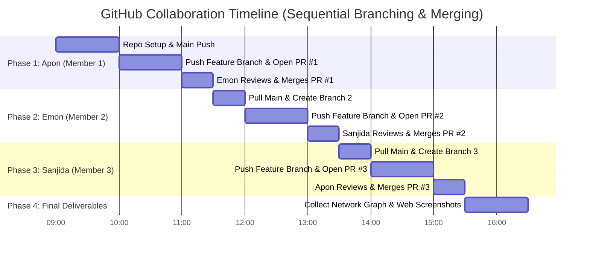

# Master GitHub Collaboration & Screenshot Guide — Lab 2 (RUET CSE 3206)

**Group #07 — Section A | Project #7: Blood Donation Management System (LifeFlow)**

This master guide provides exact step-by-step terminal commands, timing schedules, PR review protocols, and screenshot instructions for **Apon Datta**, **Emon Islam**, and **Sanjida Tabassum**.

---

## 👥 Team Roles & File Handoff Map

| Member | Student Name & Roll | Role | Git Branch Name | Assigned Files to Hand Over & Commit |
| :--- | :--- | :--- | :--- | :--- |
| **Member 1 (Lead)** | **Apon Datta** (Roll: `2203019`) | **Scrum Manager / Core Dev** | `feature/auth-user-management` | • `src/context/AppContext.jsx`<br>• `src/components/Auth/AuthModal.jsx`<br>• `src/components/Auth/ProfileModal.jsx`<br>• `src/components/Common/Navbar.jsx`<br>• `src/App.jsx`, `src/main.jsx`, `index.html` |
| **Member 2** | **Emon Islam** (Roll: `2203020`) | **Frontend Dev 1** | `feature/donor-search-requests` | • `src/components/Donor/DonorDirectory.jsx`<br>• `src/components/Donor/DonorCard.jsx`<br>• `src/components/Donor/EmergencyRequestModal.jsx`<br>• `src/components/Donor/MyRequests.jsx` |
| **Member 3** | **Sanjida Tabassum** (Roll: `2203021`) | **Frontend Dev 2** | `feature/dashboard-inventory` | • `src/components/Dashboard/MetricsOverview.jsx`<br>• `src/components/Dashboard/InventoryMatrix.jsx`<br>• `src/components/Dashboard/AdminApprovalQueue.jsx`<br>• `src/components/Dashboard/ActivityLog.jsx` |

---

## 🕒 MASTER TIMELINE & EXECUTION SCHEDULE



---

## 📸 SCREENSHOT CHECKLIST (Save all in `screenshots/` folder)

Save every screenshot with the exact filename below to include in your `README.md` and `Requirement Report.pdf`:

| # | Screenshot Filename | When to Take It | What to Capture in Browser / GitHub |
| :--- | :--- | :--- | :--- |
| 1 | `screenshots/01_repo_init_main.png` | **Phase 1** (After Apon pushes `main`) | GitHub repo homepage showing initial commit on `main` branch. |
| 2 | `screenshots/02_pr1_open_auth.png` | **Phase 1** (After Apon opens PR #1) | GitHub PR #1 page showing `feature/auth-user-management` -> `main`. |
| 3 | `screenshots/03_pr1_merged.png` | **Phase 1** (After Emon merges PR #1) | GitHub PR #1 showing purple **"Merged"** badge and merge commit. |
| 4 | `screenshots/04_pr2_open_donor.png` | **Phase 2** (After Emon opens PR #2) | GitHub PR #2 page showing `feature/donor-search-requests` -> `main`. |
| 5 | `screenshots/05_pr2_merged.png` | **Phase 2** (After Sanjida merges PR #2) | GitHub PR #2 showing purple **"Merged"** badge and review approval. |
| 6 | `screenshots/06_pr3_open_dashboard.png` | **Phase 3** (After Sanjida opens PR #3) | GitHub PR #3 page showing `feature/dashboard-inventory` -> `main`. |
| 7 | `screenshots/07_pr3_merged.png` | **Phase 3** (After Apon merges PR #3) | GitHub PR #3 showing purple **"Merged"** badge. |
| 8 | `screenshots/08_github_network_graph.png` | **Phase 4** (After all PRs merged) | GitHub Repo -> **Insights** -> **Network** graph showing 3 merged branch curves. |
| 9 | `screenshots/09_app_dashboard.png` | **Phase 4** (Running Web App) | LifeFlow Dashboard with KPI cards & Blood Inventory matrix (`http://localhost:5173`). |
| 10 | `screenshots/10_app_donor_search.png` | **Phase 4** (Running Web App) | "Find Donors" tab filtered by blood group `O+` and district `Rajshahi`. |
| 11 | `screenshots/11_app_emergency_request.png` | **Phase 4** (Running Web App) | Emergency Request Form Modal open with urgency `Critical`. |
| 12 | `screenshots/12_app_my_requests.png` | **Phase 4** (Running Web App) | "My Requests" tab showing status badges (`Pending`, `Approved`, `Fulfilled`). |

---

## 🛠️ DETAILED STEP-BY-STEP INSTRUCTIONS BY MEMBER

---

### 👤 PHASE 1: APON DATTA (Member 1 — Scrum Manager)
**Timing: Day 1 — 09:00 AM to 11:00 AM**

#### Step 1.1: Local Repo Initialization & Push Main
Open terminal in `Blood_Donation_Mangement` and run:

```bash
cd "/Users/apon/3-2/CSE 3206/Lab-2/Blood_Donation_Mangement"

# Initialize git repository
git init
git branch -M main

# Add base configuration files
git add README.md package.json index.html vite.config.js src/index.css docs/ screenshots/
git commit -m "chore: initialize LifeFlow project repository skeleton and base config"

# Link to your remote GitHub repo (Replace <YOUR-GITHUB-USERNAME> with your username)
git remote add origin https://github.com/<YOUR-GITHUB-USERNAME>/Blood_Donation_Mangement.git
git push -u origin main
```
> 📸 **TAKE SCREENSHOT #1**: `screenshots/01_repo_init_main.png` (GitHub main page).

---

#### Step 1.2: Create Auth Feature Branch & Push
```bash
# Create and switch to feature branch
git checkout -b feature/auth-user-management

# Stage Member 1 files
git add src/context/AppContext.jsx src/components/Auth/ src/components/Common/ src/App.jsx src/main.jsx

# Commit changes
git commit -m "feat(store): build central React Context state engine with LocalStorage sync"
git commit -m "feat(auth): implement user registration, login modal, role management, and donor availability toggle"

# Push feature branch to GitHub
git push -u origin feature/auth-user-management
```

---

#### Step 1.3: Open PR #1 on GitHub
1. Open GitHub repository in browser.
2. Click **"Compare & pull request"** for `feature/auth-user-management`.
3. Set Title: `feat(auth): Add User Authentication & Profile Management`.
4. In **Reviewers** sidebar, select **Emon Islam**.
> 📸 **TAKE SCREENSHOT #2**: `screenshots/02_pr1_open_auth.png` (Open PR #1 page).

---

#### Step 1.4: Emon Reviews & Merges PR #1
1. **Emon Islam** logs into GitHub, views PR #1.
2. Clicks **Files changed** -> Clicks **Review changes** -> Selects **Approve** -> Submits review.
3. Emon clicks **"Merge pull request"** -> **"Confirm merge"**.
> 📸 **TAKE SCREENSHOT #3**: `screenshots/03_pr1_merged.png` (Purple Merged badge on PR #1).

---

### 👤 PHASE 2: EMON ISLAM (Member 2 — Frontend Dev 1)
**Timing: Day 1 — 01:00 PM to 03:00 PM**

#### Step 2.1: Hand Over Member 2 Files
Hand over the `src/components/Donor/` folder files (`DonorDirectory.jsx`, `DonorCard.jsx`, `EmergencyRequestModal.jsx`, `MyRequests.jsx`) to Emon.

#### Step 2.2: Emon Clones & Creates Branch 2
Emon runs in terminal on his machine:

```bash
# Clone repository
git clone https://github.com/<YOUR-GITHUB-USERNAME>/Blood_Donation_Mangement.git
cd Blood_Donation_Mangement

# Pull updated main branch (contains Member 1 code)
git checkout main
git pull origin main

# Create feature branch 2
git checkout -b feature/donor-search-requests

# Place handed-over files into src/components/Donor/ and stage them
git add src/components/Donor/

# Commit with meaningful messages
git commit -m "feat(donor): implement donor search directory with blood group & district filters"
git commit -m "feat(request): implement emergency blood request modal and status tracking table"

# Push feature branch 2
git push -u origin feature/donor-search-requests
```

---

#### Step 2.3: Open PR #2 on GitHub
1. Emon opens GitHub repository.
2. Clicks **"Compare & pull request"** for `feature/donor-search-requests`.
3. Set Title: `feat(donor): Add Donor Search Directory & Emergency Request System`.
4. Assign **Sanjida Tabassum** as Reviewer.
> 📸 **TAKE SCREENSHOT #4**: `screenshots/04_pr2_open_donor.png` (Open PR #2 page).

---

#### Step 2.4: Sanjida Reviews & Merges PR #2
1. **Sanjida Tabassum** logs into GitHub, views PR #2.
2. Clicks **Files changed** -> Selects **Approve** -> Submits review.
3. Sanjida clicks **"Merge pull request"** -> **"Confirm merge"**.
> 📸 **TAKE SCREENSHOT #5**: `screenshots/05_pr2_merged.png` (Purple Merged badge on PR #2).

---

### 👤 PHASE 3: SANJIDA TABASSUM (Member 3 — Frontend Dev 2)
**Timing: Day 2 — 09:00 AM to 11:00 AM**

#### Step 3.1: Hand Over Member 3 Files
Hand over the `src/components/Dashboard/` folder files (`MetricsOverview.jsx`, `InventoryMatrix.jsx`, `AdminApprovalQueue.jsx`, `ActivityLog.jsx`) to Sanjida.

#### Step 3.2: Sanjida Clones & Creates Branch 3
Sanjida runs in terminal on her machine:

```bash
# Clone or pull latest main
git clone https://github.com/<YOUR-GITHUB-USERNAME>/Blood_Donation_Mangement.git
cd Blood_Donation_Mangement

# Pull updated main branch (contains Member 1 + Member 2 code)
git checkout main
git pull origin main

# Create feature branch 3
git checkout -b feature/dashboard-inventory

# Place handed-over files into src/components/Dashboard/ and stage them
git add src/components/Dashboard/

# Commit with meaningful messages
git commit -m "feat(dashboard): add KPI summary widgets and 8-blood-group inventory matrix"
git commit -m "feat(admin): implement admin approval queue and system activity audit log"

# Push feature branch 3
git push -u origin feature/dashboard-inventory
```

---

#### Step 3.3: Open PR #3 on GitHub
1. Sanjida opens GitHub repository.
2. Clicks **"Compare & pull request"** for `feature/dashboard-inventory`.
3. Set Title: `feat(dashboard): Add Analytics Dashboard & Central Blood Bank Inventory Matrix`.
4. Assign **Apon Datta** as Reviewer.
> 📸 **TAKE SCREENSHOT #6**: `screenshots/06_pr3_open_dashboard.png` (Open PR #3 page).

---

#### Step 3.4: Apon Reviews & Merges PR #3
1. **Apon Datta** logs into GitHub, views PR #3.
2. Clicks **Files changed** -> Selects **Approve** -> Submits review.
3. Apon clicks **"Merge pull request"** -> **"Confirm merge"**.
> 📸 **TAKE SCREENSHOT #7**: `screenshots/07_pr3_merged.png` (Purple Merged badge on PR #3).

---

### 🏁 PHASE 4: FINAL SYNC & REPORT SCREENSHOTS
**Timing: Day 2 — 01:00 PM to 03:00 PM**

#### Step 4.1: Final Main Pull
All team members pull the fully merged codebase:

```bash
git checkout main
git pull origin main
```

#### Step 4.2: Collect Network Graph Screenshot
1. Go to GitHub Repository -> **Insights** tab -> Click **Network** in left menu.
2. You will see 3 distinct branch curves merging into `main`.
> 📸 **TAKE SCREENSHOT #8**: `screenshots/08_github_network_graph.png`.

#### Step 4.3: Collect Web App Screenshots
Run `npm run dev` and open `http://localhost:5173`:
> 📸 **TAKE SCREENSHOT #9**: `screenshots/09_app_dashboard.png` (Dashboard View).  
> 📸 **TAKE SCREENSHOT #10**: `screenshots/10_app_donor_search.png` (Find Donors Tab).  
> 📸 **TAKE SCREENSHOT #11**: `screenshots/11_app_emergency_request.png` (Emergency Request Modal).  
> 📸 **TAKE SCREENSHOT #12**: `screenshots/12_app_my_requests.png` (My Requests Tab).  

---

## 🎯 Final Checklist for 100% (10/10 Marks)
- [x] Repository created on GitHub.
- [x] Minimum 3 Feature Branches (`feature/auth-user-management`, `feature/donor-search-requests`, `feature/dashboard-inventory`).
- [x] Minimum 3 Pull Requests with review approvals.
- [x] Clean commit history showing contributions by Apon Datta, Emon Islam, and Sanjida Tabassum.
- [x] 12 Screenshots collected in `screenshots/` directory.
- [x] `Requirement Report.pdf` submitted in `docs/` folder.
